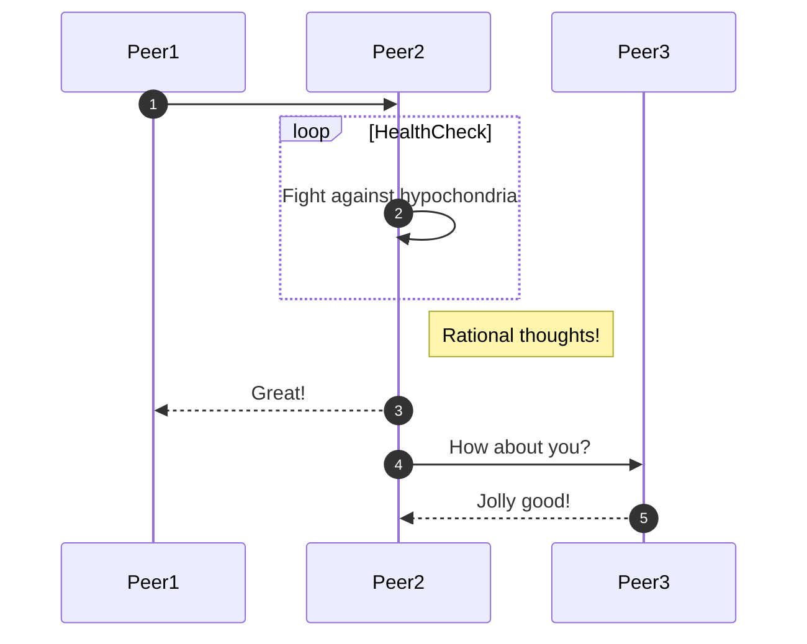

# Ephemeral Key Formation

```mermaid
    sequenceDiagram
    autonumber
    Peer1->>Peer2: 
    loop HealthCheck
        Peer2->>Peer2: Fight against hypochondria
    end
    Note right of Peer2: Rational thoughts!
    Peer2-->>Peer1: Great!
    Peer2->>Peer3: How about you?
    Peer3-->>Peer2: Jolly good!
```