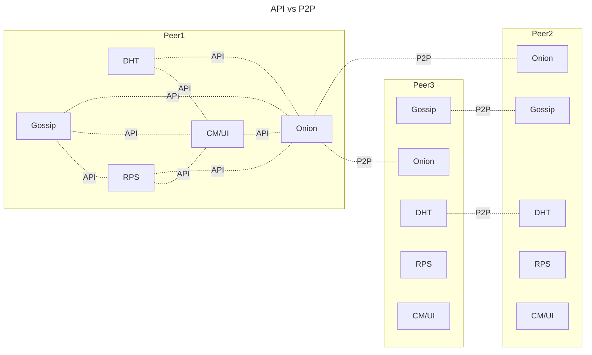

# High Level Overview 

## API vs P2P
As described in the specification, there are 2 types of communications: **API** and **P2P** communication. API communication is used to facilitate information exchange between different modules of the same node instance, whereas P2P communication enables different nodes from the P2P netweork to communicate. The following graph visualizes the above-mentioned concept.

## High Level Design

There'll be 3 active threads for each node categorized as follows:

- API Thread
- P2P Thread
- Round Thread

There'll also be intermediate threads spawned & maanged by the above three threads.

Communication between  threads is handled through dumping/polling channels

### Channels

1. API -> Round
  - Transfering identification information for the destination node.
2. Round -> API
  - Telling API thread that the Onion Tunnel is ready

### API Thread

#### API 1: Build Tunnel

- **Request Type**: `ONION TUNNEL BUILD`
- **Callee**: CM/UI Module
- **Connection Type**: Async
- **Functionality**:
    - Forward data to Round Thread via channel.
    - Wait for response data from the Round Thread.
        - Success: Send `ONION TUNNEL READY` to CM/UI module.
        - Failure:
- 

#### API 2: 

### P2P Thread 

#### P2P Thread 1
- `ONION TUNNEL INCOMING` tells CM/UI module that that there will be incomming onion traffic (Similar to that somebody is calling to you)

### Round Thread

- **Connection**: API Thread
