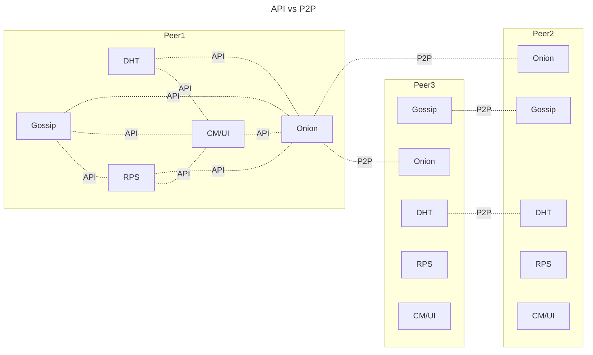

# High Level Overview 

## API vs P2P
As described in the specification, there are 2 types of communications: **API** and **P2P** communication. API communication is used to facilitate information exchange between different modules of the same node instance, whereas P2P communication enables different nodes from the P2P netweork to communicate. The following graph visualizes the above-mentioned concept.

## Naive Representation of How VoidPhone Works 

Following is an excerpt from the specification:
>  1. Peers join at the beginning of a round. If a peer joins after the round, it is considered
as online for the next round.

 - This statement implicates that there is some kind of threshold \\(\delta\\) for joining the network which we have to define
 - We have to define  as well how long the round takes: \\(t_{round}\\)

>  2. A new peer initially knows some of the existing peers. It can get this information from
a bootstrapping service, or it is manually configured by the user while starting the
peer. The new peer then connects to these peers, and asks them to give it some of the
peers they know of. This way, the new peer acquires partial of knowledge of existing
peers.
- Knowledge is nothing but the respective public keys of other peers

>  3. The new peer then establishes connections to some of the peers it knows.

>  4. Peers exchange information about existing peers using gossip

>  5. At the beginning of each round, peers randomly choose two peers whom they already know of. They then attempt to build an onion tunnel through them.
- Again the notion of the "beginning of the round" related to threshold \\(\delta\\)
>  6. If a peer has to make a call, it has to wait until the next round. It then uses the tunnel
established in that round to call the destination.
- Tunnel building is independent of whether an user wants to make a call or not
- This means that the user can't use the tunnel that has been created for the current round but has to wait for the next one. Hence, for usability purposes, 
\\(t_{round}\\) must be negligably small. 
>  7. If a peer is not actively communicating during the round, it will send cover traffic with
characteristics of VoIP traffic through the tunnel. The cover traffic will be visible to
the last hop in the tunnel and is then echoed back by it.
- Peer is not actively communicating if it's not asked to from CM/UI Module. This is the reason why for instance sending `ONION COVER` is illegal when 
onion tunnel has been established as a result of `ONION TUNNEL BUILD` (Which is called from CM/UI to Onion Module) and Onion Module replied with `ONION TUNNEL READY` (From Onion Module back to CM\UI)

>  8. For a user to be able to receive calls the calling party should be able to know the
network address of the user’s peer. For this, the user’s peer advertises through gossip
its network address. [This information is signed with the private key corresponding
to the hostkey, so that only the peers having the corresponding public key are able
to decrypt this information. The information will contain, as part of the header
information, the peer’s identity (the hash of the public key), so that other peers can
easily identify the data packet]

## High Level Design

There'll be 3 active threads for each node categorized as follows:

- API Thread
- P2P Thread
- Round Thread

There'll also be intermediate threads spawned & maanged by the above three threads.

Communication between  threads is handled through dumping/polling channels

### Channels

1. API -> Round
  - Transfering identification information for the destination node.
2. Round -> API
  - Telling API thread that the Onion Tunnel is ready

### API Thread

#### API 1: Build Tunnel

- **Request Type**: `ONION TUNNEL BUILD`
- **Callee**: CM/UI Module
- **Connection Type**: Async
- **Functionality**:
    - Forward data to Round Thread via channel.
    - Wait for response data from the Round Thread.
        - Success: Send `ONION TUNNEL READY` to CM/UI module.
        - Failure:
- 

#### API 2: 

### P2P Thread 

#### P2P Thread 1
- `ONION TUNNEL INCOMING` tells CM/UI module that that there will be incomming onion traffic (Similar to that somebody is calling to you)

### Round Thread

- **Connection**: API Thread
