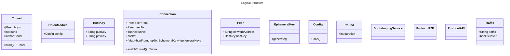

# Midterm Report

## Changes To  the Initial Report
There were no changes made.
## Architecture of our Module

### Logical Structure (Classes/Specs)

---
|Name|Functionality| Fields/Methods |
| --- | --- | --- |  
| Onion Module (OM) | Construct tunnels and execute main functionality | peer
| Tunnel | Onion Tunnel | Peers (Hops), round, hopCount, config, build(), extend()
|Traffic| Data transmitted trough tunnels, cover or real| isTraffic, packetSize, createCoverTraffic|
| Connection | Represents an Open Connection using a Tunnel. Changes Tunnels From Round to Round | peerFrom, peerTo switchTunnel(), ephemeralKeys, socket
|Peer| Represents an Onion Node (Peer) | networkAddress, hostkey, tunnel, round, connections,  
|Hostkey| Represents a Hoskey, i.e Public-private Key Pair | pubKey, privKey
|Ephemeral Key| Represents a session, ephemeral key created during connection initialization| generate()
|Round| Represents a Round | duration
|Bootstraping Service| Represents a service which is responsible for bootstraping the "genesis" Peer-To-Peer Network (Maybe for testing purposes)
|Config| Config File | addrToHostkeys, roundDuration, packetSize, api_address (where to listen API connections), load()
|P2P_Protocol|Describes P2P Message Formats| |
|API_Protocol|Describes API Message Formats| ONION_TUNNEL_BUILD, etc.|
|Serializer| Wrapper for serializer (Protobuf)| serialize() |

### Graphical Representation of The Logical Structure

### Process Architecture

### Networking

## Security Measures

### Authentication and Integrity

### Perfect Forward Secrecy

## Specification of the Peer-To-Peer Protocol

## Future Work

## Workload Distribution - Who Did What? 

## Effort Spent for the Project