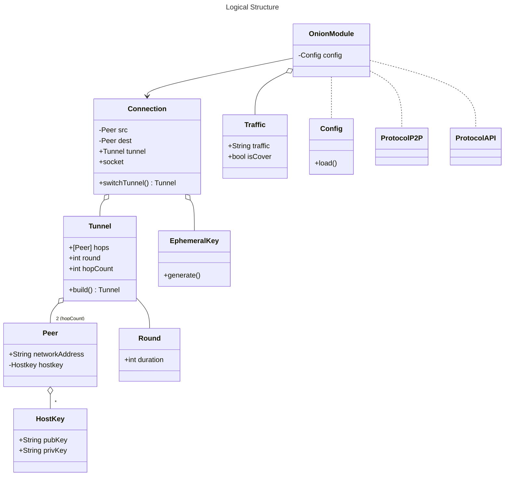

# Midterm Report

## Changes To  the Initial Report
There were no changes made.
## Architecture of our Module

### Logical Structure (Classes/Specs)

---
|Name|Functionality| Fields/Methods |
| --- | --- | --- |  
| Onion Module (OM) | Construct tunnels and execute main functionality | peer
| Tunnel | Onion Tunnel | Peers (Hops), round, hopCount, config, build(), extend()
|Traffic| Data transmitted trough tunnels, cover or real| isTraffic, packetSize, createCoverTraffic|
| Connection | Represents an Open Connection using a Tunnel. Changes Tunnels From Round to Round | peerFrom, peerTo switchTunnel(), ephemeralKeys, socket
|Peer| Represents an Onion Node (Peer) | networkAddress, hostkey, tunnel, round, connections,  
|Hostkey| Represents a Hoskey, i.e Public-private Key Pair | pubKey, privKey
|Ephemeral Key| Represents a session, ephemeral key created during connection initialization| generate()
|Round| Represents a Round | duration
|Bootstraping Service| Represents a service which is responsible for bootstraping the "genesis" Peer-To-Peer Network (Maybe for testing purposes)
|Config| Config File | addrToHostkeys, roundDuration, packetSize, api_address (where to listen API connections), load()
|P2P_Protocol|Describes P2P Message Formats| |
|API_Protocol|Describes API Message Formats| ONION_TUNNEL_BUILD, etc.|
|Serializer| Wrapper for serializer (Protobuf)| serialize() |

### Graphical Representation of The Logical Structure

### Process Architecture

### Networking

## Security Measures

Whenever designing a Peer-To-Peer architecture, modelling adversaries inside the network is a major part of a
good decision-making process. We would like to make strict adversary assumption to ensure high security. However, there is always trade-Off between usability and security. We keep that in mind as well and make our implementation generic so that the users can decide what they prefer. In order to underline what we think facilitates high security standards, we 
introduce couple of terms as described in the [RFC2119](https://link-url-here.orghttps://datatracker.ietf.org/doc/html/rfc2119): **MUST**, **MUST NOT**, **SHOULD**. 

These are the security measures we want to take in our Project: 

---
|Goal|Measure|
|---|---|
|Authentication & Integrity|We'll use [tls package](https://pkg.go.dev/crypto/tls) from the standard Crypto Library of Golang. We'll define TLS Version 1.3 as our default choice to mitigate securiy risks related to older versions such as weak Ellitic Curves. However if weak algorithms and Cipher Suites known for TLS Version 1.2 is avoided, TLS 1.2 works as well. Therefore we'll give our users option to choose between those 2. Our recommention: Users **SHOULD** go for the default version, i.e TLS 1.3. We may have to modify or partly use the tls package in combination with our P2P Protocol but we'll finalize our thoughts about that in our final report.|
|Forward Secrecy|Diffie-Hellman (Elliptic Curve) Key Exchange for Ephemeral Key Formation.|
|Avoid Exposure of the "master" Hostkey|Provide users an option to generate secondary hostkeys and keep the original hostkeys "cold". Sign with them only in special cases. A user of our Onion Module **SHOULD** use this option. In the case of utilizing this approach, new keys have to be dissaminated in the network through Gossip| 
|Client Authentication|Client Authentication is almost always regarded optional nowadays. However, we think that in Peer-To-Peer architecture, this should be default to ensure higher security standards. Therefore our default configuration will authenticate Clients as well (Source Onion Module). Our users **SHOULD** use the option for client authentication.|
|Certificate Issuance| In the *Authentication & Integrity* section we discussed that we may only partly utilize the tls package in our project. One of the reasons could be that we don't necessarily have a Certificate Authority according to the specification. If we **don't** use CA option we may add P2P Protocol Specification where we'll send Challenge to the Server and the Response **MUST** be signed by the hostkey. However, if we have time, we'll try to integrate [letsencrypt](https://letsencrypt.org/de/) in our project. Certificate Autorities have its drawbacks but we strongly believe that concepts such as Certificate Transparency (CT) will counter the intrinisic issues related to CAs. Letsencrypt submits all certificates they issue to CT logs.|
|Minimize Space for Traffic Analysis| [Latest Research](https://arxiv.org/abs/1808.07285) shows that modern learning algorithms can learn correlation function for Tor's network, which is an implementaion of Onion Routing just like ours. Their approach provides 96% flow correlation accuracy which reuslts in deanonymized connections. One method to minimize the attack surface is to make data flow as homogenous and non-differantiable as possible. This can be done through choosing fixed package sizes. However, to ensure higher degree of security, users **SHOULD** use VPN connections but in a [right order](https://old.reddit.com/r/TOR/comments/rzxuex/in_what_circumstances_would_using_tor_over_vpn_be/hryfo3k/). |

## Specification of the Peer-To-Peer Protocol

## Future Work

## Workload Distribution - Who Did What? 

## Effort Spent for the Project