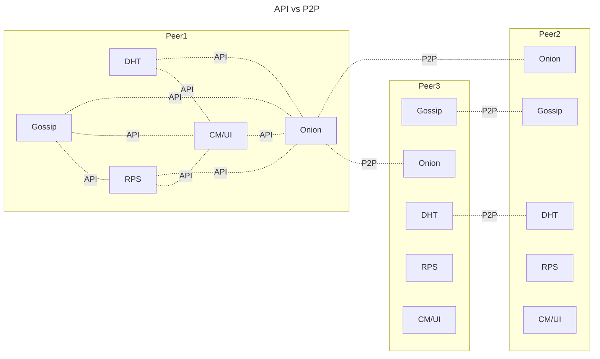
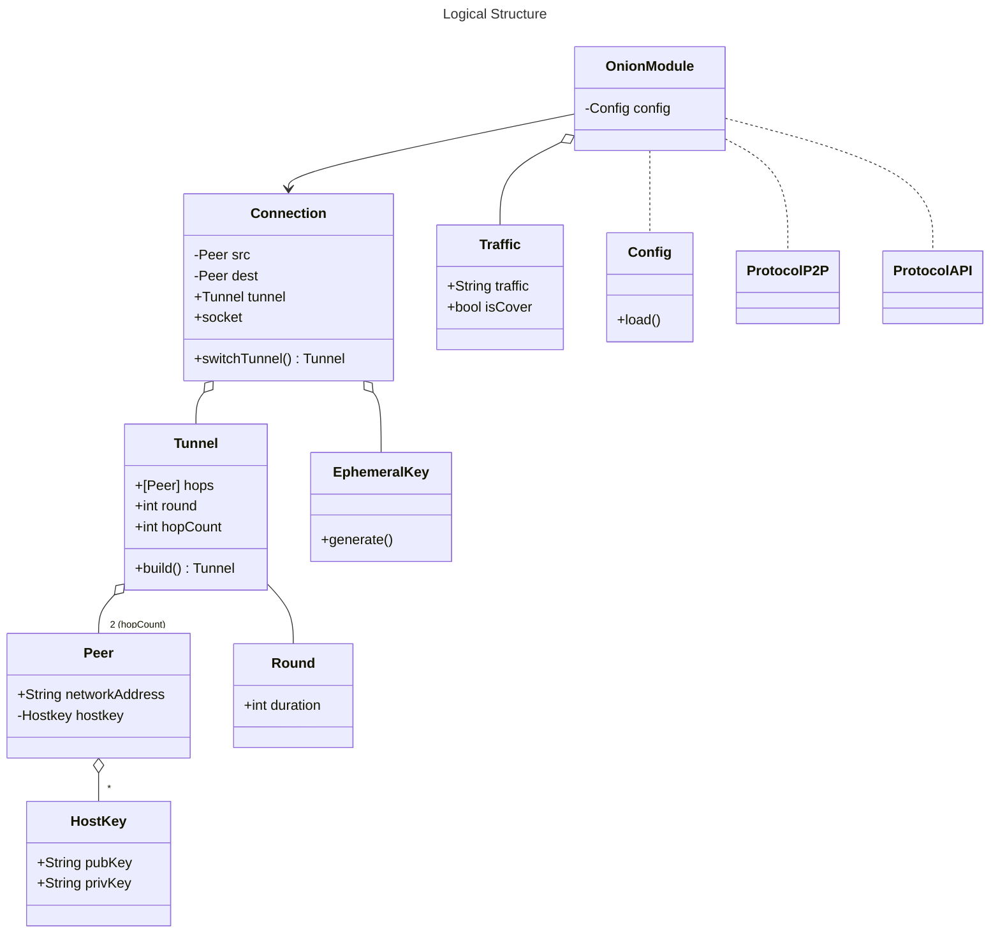

# Midterm Report

Hammad Nasir

## Changes To  the Initial Report
There were no changes made.
## Architecture of our Module

### High Level Overview 

## API vs P2P
As described in the specification, there are 2 types of communications: **API** and **P2P** communication. API communication is used to facilitate information exchange between different modules of the same node instance, whereas P2P communication enables different nodes from the P2P netweork to communicate. The following graph visualizes the above-mentioned concept.

### Logical Structure (Classes/Specs)

---
|Name|Functionality| Fields/Methods |
| --- | --- | --- |  
| Onion Module (OM) | Construct tunnels and execute main functionality | run(), traffic, connection, config
| Tunnel | Onion Tunnel | Peers (Hops), round, hopCount, config, build(), extend()
|Traffic| Data transmitted trough tunnels, cover or real| isTraffic, packetSize, createCoverTraffic|
| Connection | Represents an Open Connection using a Tunnel. Changes Tunnels From Round to Round | peerFrom, peerTo switchTunnel(), ephemeralKeys, socket
|Peer| Represents an Onion Node (Peer) | networkAddress, hostkey, tunnel, round, connections,  
|Hostkey| Represents a Hoskey, i.e Public-private Key Pair | pubKey, privKey
|Ephemeral Key| Represents an ephemeral key created during connection initialization| generate()
|Round| Represents a Round | duration
|Bootstraping Service| Represents a service which is responsible for bootstraping the "genesis" Peer-To-Peer Network (Maybe for testing purposes)
|Config| Config File | addrToHostkeys, roundDuration, packetSize, api_address (where to listen API connections), load()
|P2P_Protocol|Describes P2P Message Formats| |
|API_Protocol|Describes API Message Formats| ONION_TUNNEL_BUILD, etc.|
|Serializer| Wrapper for serializer (Protobuf)| serialize() |

### Graphical Representation of The Logical Structure

### Process Architecture

### Networking

## Security Measures

Whenever designing a Peer-To-Peer architecture, modelling adversaries inside the network is a major part of a
good decision-making process. We would like to make strict adversary assumption to ensure high security. However, there is always trade-Off between usability and security. We keep that in mind as well and make our implementation generic so that the users can decide what they prefer. In order to underline what we think facilitates high security standards, we 
introduce couple of terms as described in the [RFC2119](https://link-url-here.orghttps://datatracker.ietf.org/doc/html/rfc2119): **MUST**, **MUST NOT**, **SHOULD**. 

These are the security measures we want to take in our Project: 

---
|Goal|Why|Measure|
|---|---|---|
|Encryption, Authentication & Integrity|Without Encryption data is transmitted as a plaintext. If Alice is talking to Bob, any other party is able to eavesdrop the communication. Without Authentication malicious peers could impersonate others. In our context: If Malory is able to impersonate Bob and call Alice, Alice will think that she is talking with Bob but in reality she is talking with Malory. Without integrity, messages can be be tampered without noticing. | We'll use [tls package](https://pkg.go.dev/crypto/tls) from the standard Crypto Library of Golang that acomplishes encryption, authentication and integrity. We'll define TLS Version 1.3 as our default choice to mitigate securiy risks related to older versions such as weak Ellitic Curves. However if weak algorithms and Cipher Suites known for TLS Version 1.2 is avoided, TLS 1.2 works as well. Therefore we'll give our users option to choose between those 2. Our recommention: Users **SHOULD** go for the default version, i.e TLS 1.3. We may have to only partly use the tls package in combination with our P2P Protocol but we'll finalize our thoughts about that in our final report.|
|Forward Secrecy|Without forward secrecy leaked secrets could lead to leaked information. For instance, if ephemeral keys are transmitted through channels and that channel is compromised, an attacker could use ephemeral keys to decrypt data encrypted with those. |Diffie-Hellman (Elliptic Curve) Key Exchange for Ephemeral Key Formation which is part of the TLS. In the case of Diffie-Hellman, secrets aren't transmitted through channels but only paramters for computing secrets. However, computing the key using those parameters depends on the discrete logarithm problem which is computationally infeasible to solve. Since Elliptic Curve based schemes have stronger security per bit, this means that we can achieve same security level as in the case of RSA with much less data transmitted over the network. In our context, this will enhance call quality, since formation of the secure channel over which Alice and Bob will communicate, will be much faster.|
|Client & Server Authentication| In the case of standard telephony, identities are mapped with phone numbers. In our case, i.e IP-Telephony, phone numbers are replaced with IP addresses. However, IP addresses can be spoofed. Therefore authentication in both directions is detrimental. |Whereas server authentication is a stardard, client Authentication is almost always regarded optional nowadays. However, we think that in Peer-To-Peer architecture and especially in our context, this should be encouraged to ensure higher security standards. Therefore our default configuration will authenticate Clients as well (Source Onion Module). Our users **SHOULD** use the option for client authentication. Again, the trade-off would be clients not to authenticate themselves and for that the call will happen much faster.|
|Certificates and Secure Bootstraping |Proving identity is of major importance in any network infrustructure. TLS uses PKI (Public Key Infrustructure) to map identities to public keys. In our case, these are *Hostkeys*. However, we want to discourage PKI in our network since PKIs are realized through trusted third parties. Despite the fact that PKIs are considered secure through utilizing CT (Certificate Transparency) and many more mature mechanisms, we still think that avoiding trusted parties should always be the goal of a Peer-To-Peer.| We would like to issue certificates using Peer-To-Peer network only. For simplicity purposes, we would define some peers as trusted and they will be able to issue certificates for new joiners. However, we discuss more sophisticated approaches in the [Future Work](/src/reports/midterm_report.md#future-work) section.|
|Minimize Space for Traffic Analysis|[Latest Research](https://arxiv.org/abs/1808.07285) shows that modern learning algorithms can learn correlation function for Tor's network, which is an implementaion of Onion Routing just like ours. Their approach provides 96% flow correlation accuracy which reuslts in deanonymized connections.|  One method to minimize the attack surface is to make data flow as homogenous and non-differantiable as possible. This can be done through choosing fixed package sizes. However, to ensure higher degree of security, users **SHOULD** use VPN connections but in a [right order](https://old.reddit.com/r/TOR/comments/rzxuex/in_what_circumstances_would_using_tor_over_vpn_be/hryfo3k/). |
|Limit Sybill Attacks|Sybil Attacks mostly occur when fake identities are being created to gain large influence on the network. This could result in degraded network performance. In our context: If Alice wants to call Bob and chooses relays (one of them or all) from a sybill sub-network, the call quality can be affected since sybill group memebers can decide not to act as hops or not to redirect the traffic to other hops. The probability of this vulnerability to happen increases with increased number of fake identities. |Proof of Work: Creating new identities will require solving hard puzzles resulting in infeasibility of issueing multiple fake identities. In our implementation, the original identities (hostkey) that are present in the very first network are considered valid. If new peers want to join the network, they have to register themselves to one of the peers that are present in the network. Registering means solving a puzzle acquired from trusted peers in the network and signing them with the new identity. |
|DDoS Protection|A malicios actor in our network could call multiple Onion Modules to congest the network and execute a DDoS attack. For instance, Malory (Malicios Actor) calls every participant in the network. Alice wants to call Bob, but Bob is talking with Malory and the communication between Alice and Bob can't happen anymore | We'll apply rate limiting, hence a peer is able to call only limited amount of participants (or only one) in the network at the same time. Monitoring if every peer adheres to this rule can be done through Gossip Protocol. |

## Specification of the Peer-To-Peer Protocol

|Field| Size| 
|---|---|
|size|2 bytes|
|P2P Command|2 bytes|

## Future Work

### Group Certificates Through Ring Signatures 
As opposed to signing the identity of a peer with a single trusted peer, we would like to introduce group signing mechanism through [Ring Signatures](https://en.wikipedia.org/wiki/Ring_signature#:~:text=In%20cryptography%2C%20a%20ring%20signature,a%20particular%20set%20of%20people.). The advantage of this approach is that instead of a single trusted peer, a set of trusted peers identities (public keys) are used to sign a message. 

## Workload Distribution - Who Did What? 

## Effort Spent for the Project
